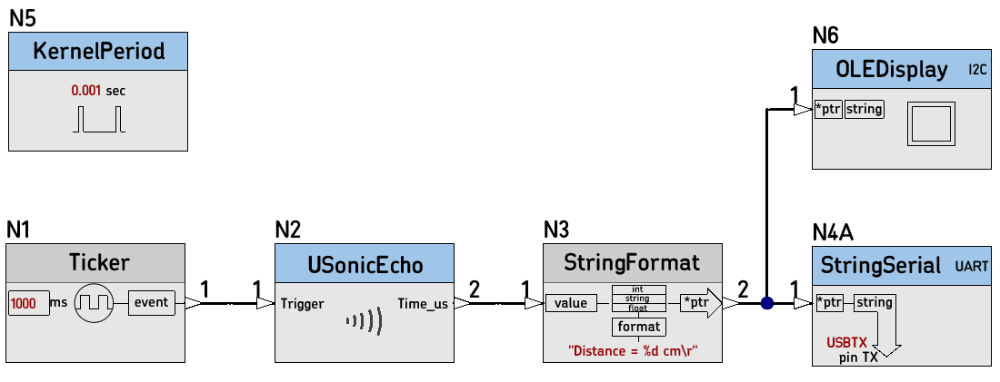

# 25D_KernelPeriod_test

Using the new Node `KernelPeriod', the kernel period can be changed by just modifying the Node parameter.

This nBlocksStudio project was created automatically from a Schematic Design.  It is testing the new Kernel version `[a14d29e]` [nBlocksStudio Kernel](https://github.com/nblocksStudio/nBlocksStudioKernel ), in a Design that displays the Ultrasonic measured distance to an OLED-display and a PC serial terminal 

The 'normal' kernel tick period is  0.001 sec. Here the Node `KernelPeriod` set it up to periods from 100us to 1.0s to confirm the system operates properly.

<!-- pagebreak -->

## Testing

 * The  :heavy_check_mark:
 * The string "Value: 1\n" is printed in the serial port :heavy_check_mark:
 * The printing happens every 1000ms :heavy_check_mark:
 * Compiled and Build with mbed-studio os5 bare-metal :heavy_check_mark:

## Node KernelPeriod source code notes

----

----

The first parameter is the source,  can be either `KERNEL_TICK_TIMER` or `KERNEL_TICK_EXT`.

If `KERNEL_TICK_EXT` is used, then the second argument is the pin name for the external clock to be used as tick

 ## Contributors
|Task              |Contributor       |Date
|------------------|------------------|------------------|
| Requirements     |N. Chalikias|03/01/2021|
| Implementation, update of the Kernel code |F. Cosentino|03/02/2021|
| Testing-program:                    |F. Cosentino|03/02/2021|
| Testing-program port to mbed-studio |N. Chalikias|03/02/2021|
| Readme.md and images creation       |N. Chalikias|03/02/2021|
